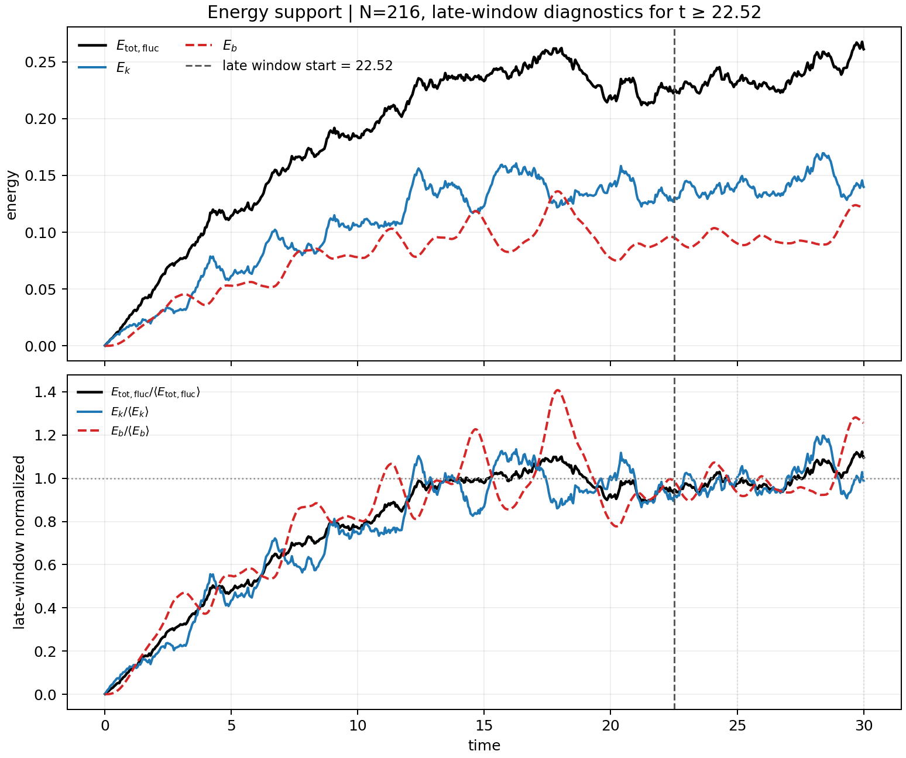

# Compressible MHD Simulation Activator

This workspace is a compact launcher for a three-dimensional, isothermal,
compressible MHD turbulence simulation. It expects a local checkout of the
external `MHDFlows` package and writes snapshots plus an energy-history
stability support file.

The activator intentionally does not contain mode decomposition. Snapshots are
kept as HDF5 files so a separate analysis project can consume them later.

## Setup

Install Julia, then clone or unpack the upstream `MHDFlows` package into:

```text
MHDFlows_dev-main/
```

That folder is intentionally ignored by Git because it is external code. If you
keep the package elsewhere, set `mhdflows_project` in
`configs/config.local.toml`, or set `MHDFLOWS_PROJECT` before running the
scripts.

Instantiate the solver environment once:

```powershell
julia --project=.\MHDFlows_dev-main -e 'using Pkg; Pkg.instantiate()'
```

The solver supports a single CPU or a single CUDA-capable GPU. The launcher
selects a functional GPU when available and falls back to the CPU otherwise.
For CPU-only machines, the runner installs a small runtime compatibility shim
in memory. It does not edit the external `MHDFlows` checkout on disk.

## Configure

Copy the tracked example config to your ignored local config:

```powershell
Copy-Item .\configs\config.example.toml .\configs\config.local.toml
```

Edit `configs/config.local.toml` for your machine and run settings:

```toml
mhdflows_project = "MHDFlows_dev-main"
output_root = "outputs"
device = "auto" # auto, cpu, or gpu

nx = 128
end_time = 60.0
forcing_power = 8000.0
viscosity = 0.01
resistivity = 0.01
snapshot_dt = 5.0
seed = 1234
```

`configs/config.local.toml` is ignored by Git, so local machine paths and
experiment notes stay out of GitHub. A legacy root `config.local.toml` is still
accepted for existing local workspaces.

## Run

Start a simulation with the defaults:

```powershell
julia .\scripts\run_simulation.jl
```

Optional positional overrides preserve the order used by the original script:

```text
julia scripts/run_simulation.jl [--config configs/config.local.toml] [nx] [end_time] [forcing_power] [viscosity] [resistivity] [tag_suffix] [fixed_dt] [snapshot_dt] [seed]
```

Set `fixed_dt` to `0` to use the solver's adaptive CFL timestep.

The normal runner is foreground: it prints progress in the current terminal and
returns only when the simulation finishes. For long runs, start it in the
background and write logs under `logs/`.

On Windows PowerShell:

```powershell
.\scripts\run_background.ps1 -Config .\configs\config.local.toml
```

For a quick background smoke test with positional overrides:

```powershell
.\scripts\run_background.ps1 -Config .\configs\config.local.toml -- 8 0.001 10 0.01 0.01 smoke 0.001 0.01 1234
```

On Linux/macOS or a remote shell:

```bash
./scripts/run_background.sh --config configs/config.local.toml
```

Both wrappers print a process ID and log file path. The `logs/` directory is
ignored by Git.

Device selection comes from `device` in `configs/config.local.toml`:

```toml
device = "auto" # auto, cpu, or gpu
```

`gpu` means the `GPU()` device used by `MHDFlows`/`FourierFlows` with CUDA.jl.
`auto` uses GPU only when CUDA is functional, otherwise CPU.

The default model is a periodic `128^3` compressible MHD box with:

| Parameter | Default |
| --- | --- |
| Box size | `2pi` |
| Sound speed | `sqrt(2)` |
| Viscosity and resistivity | `0.01`, `0.01` |
| Mean magnetic field | `(1, 0, 0)` |
| Forcing wavenumber | `2` |
| Forcing power | `8000` |
| End time | `60` |
| Snapshot interval | `5` |
| Random seed | `1234` |

## Outputs

Each case is written under the configured `output_root`, normally
`outputs/<case-tag>/`:

```text
analysis/case_metadata.toml
analysis/energy_history.csv
figures/energy_history_support.png
snapshots/state_t_*.h5
```

The CSV is checkpointed while the simulation runs. The PNG is generated after
integration finishes and compares kinetic energy, fluctuating magnetic energy,
and their sum. Its lower panel normalizes each curve against the final 25% of
the sampled time range to make late-time stability easier to inspect. The CSV
is intentionally limited to energy-support columns: `time`, `rho_mean`,
`kinetic`, `magnetic_total`, `magnetic_fluct`, `total_resolved`, and
`fluct_total`.

Snapshot-only compact diagnostics are written in `analysis/case_metadata.toml`
under `[[snapshot_diagnostics]]`. Rows correspond to the HDF5 snapshots,
including `snapshots/state_t_0000.h5`, so follow-up particle-transport
analysis can select one snapshot and use diagnostics from the same time.

The runner uses the density-weighted turbulent velocity

```text
u_rms = sqrt(<rho |u - <u>_rho|^2> / <rho>)
```

and the configured isothermal sound speed:

```text
M_s = u_rms / c_s
```

For Alfvenic Mach numbers, the relevant definition is velocity divided by an
Alfven speed, not `<B> / B`:

```text
v_A(B_ref) = B_ref / sqrt(<rho>)
M_A(B_ref) = u_rms / v_A(B_ref)
```

This matches the code normalization used by the existing magnetic energy
diagnostic, `0.5 * <|B|^2>`.

The snapshot metadata records the guide/mean-field Alfvenic Mach number:

| Metadata field | Magnetic reference |
| --- | --- |
| `alfven_mach_mean` | `norm(mean(B))`, the guide/mean field |

Each row records only `file`, `time`, `rho_mean`,
`magnetic_mean_strength`, `magnetic_rms_fluct`, `velocity_fluct_rms`,
`alfven_mach_mean`, and `sonic_mach`. Existing `.h5` snapshots contain
`gas_density`, `i_velocity`, `j_velocity`, `k_velocity`, `i_mag_field`,
`j_mag_field`, `k_mag_field`, and `time`, so other diagnostics can still be
regenerated from snapshots if needed.

To compare runs, change the input parameters and let the diagnostics measure
the resulting state. `sound_speed` directly changes `M_s`; larger `c_s` lowers
`M_s` for the same turbulent velocity. `mean_field` directly changes the
mean-field Alfven speed; a stronger guide field lowers `alfven_mach_mean`.
`forcing_power` changes the driven turbulent velocity and therefore changes
both `M_s` and `M_A`. `viscosity` and `resistivity` mainly change dissipation,
Reynolds number, and saturation behavior, so they affect Mach numbers
indirectly rather than serving as clean Mach-number knobs.



Regenerate the figure for the newest completed case:

```powershell
julia .\scripts\plot_energy_history.jl
```

Or provide a specific case directory:

```powershell
julia .\scripts\plot_energy_history.jl .\outputs\<case-tag>
```

## Repository Notes

Generated outputs are ignored by Git because HDF5 snapshots can become large.
`MHDFlows_dev-main/` is also ignored because it is an external package checkout,
not original code from this repository. `configs/config.local.toml`,
legacy `config.local.toml`, and `task*.md` are ignored because they are
machine-local working notes/settings.
